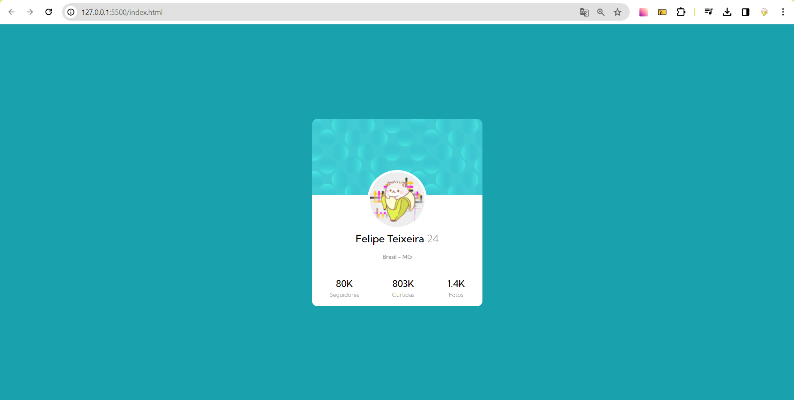

# Frontend Mentor - Profile card component

## Welcome!

This is a solution to the [Profile card component challenge on Frontend Mentor](https://www.frontendmentor.io/challenges/profile-card-component-cfArpWshJ). Frontend Mentor challenges help you improve your coding skills by building realistic projects. 

## The challenge

My task was to replicate the profile card component to closely resemble the provided design.

## Implementation

I utilized HTML and CSS to recreate the profile card, breaking down the challenge into manageable parts to achieve the desired outcome.

## Technologies Used

- Semantic HTML5;
- CSS custom properties;
- Flexbox;

### The result of challenge

### Link

- Solution URL: [fctexi.github.io/Projeto-profile-card](https://fctexi.github.io/Projeto-profile-card/)
